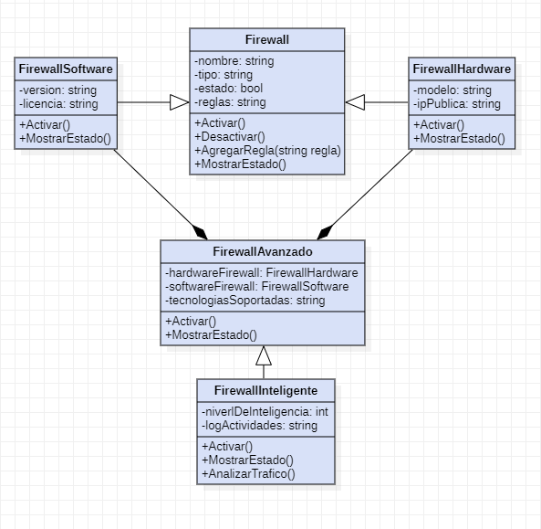
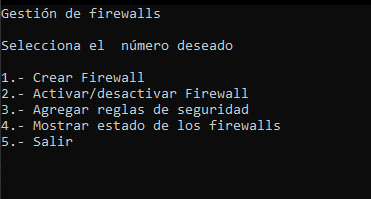
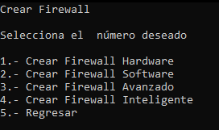
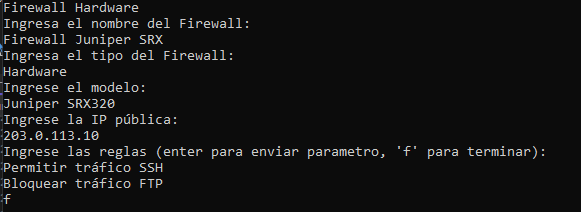
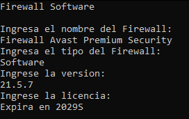
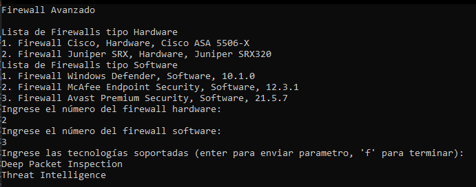
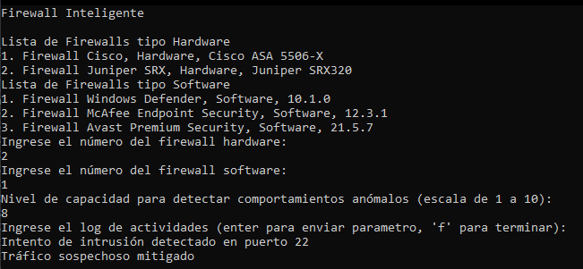
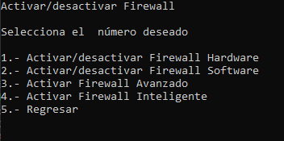
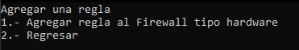
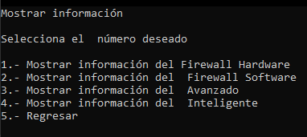

# Firewalls

A console program that simulates a firewall management system, focusing on the use of inheritance, polymorphism, and method overloading to represent different types of firewalls, with advanced features that allow for greater customization and flexibility in management.

## Class Diagram

## Features
- The program is designed using OOP concepts such as encapsulation, inheritance, and polymorphism to ensure modularity and scalability.
- The Firewall base class defines common attributes and methods, while derived classes (FirewallHardware, FirewallSoftware, FirewallAvanzado, and FirewallInteligente) extend its functionality.
- Methods like Activar() and MostrarEstado() are overridden in derived classes to provide specialized behavior for each firewall type.
- FirewallAvanzado contains instances of FirewallHardware and FirewallSoftware, integrating both functionalities.
- The system adapts based on the type of firewall, demonstrating polymorphic method execution.

## How to Use
* The menu shows the options of "Firewall Management"

1. Here you can create a Firewall type: Hardware, Software, Advanced or Intelligent.

- Enter the hardware firewall information

- Enter the software firewall information

- Enter the hardware Advanced information

- Enter the hardware Intelligent information

2. Toggle the firewall status between on and off.

3. Add a rule for hardware firewall

4. Shows the status of the Firewalls

## Built With
- C#

## 👨‍💻 Author
- **CalalpaGus** - [GitHub](https://github.com/CalalpaGus/)
